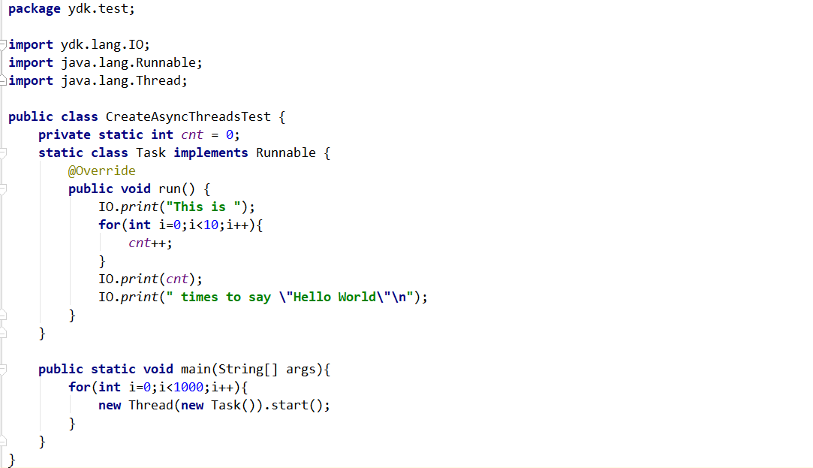
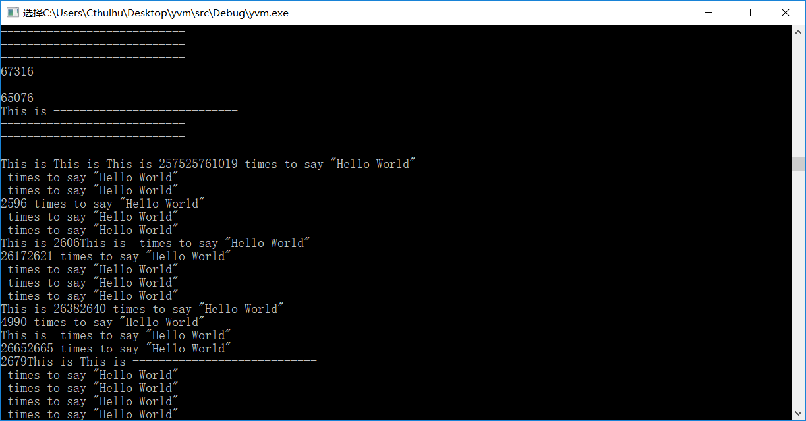

# YVM
This is a homemade Java virtual machine written by c++, the main components are conform to [Java Virtual Machine Specification 8](https://docs.oracle.com/javase/specs/jvms/se8/jvms8.pdf). Now it is runnable and sorts of language features will add into this VM in progress. I don't have time to write unittests to verify all aspects, so if you find any bugs, you can open an [Issue](https://github.com/racaljk/yvm/issues/new) or fix up in place and pull request directly. :) 

# Available language features
:-0 Advanced language features will support later, you can also PR to help me
+ Java arithmetic, flow control, object-oriented programming(virtual method, inherit,etc.)
+ [Runtime type identification](./javalib_src/ydk/test/InstanceofTest.java)
+ [String concatenation](./javalib_src/ydk/test/StringConcatenation.java)
+ [Exception handling](./javalib_src/ydk/test/ThrowExceptionTest.java)
+ [Async native threads](./javalib_src/ydk/test/CreateAsyncThreadsTest.java)

# Usage
0. You can use `G++7.0`/`MSVC 2017` to compile it with -std=c++11 or newer. And using cmake is also available, we don't need to set any building options.
1. Running flags
```bash
# --runtime to specify runtime libraries of Java program, use ";" to split multi paths
# ydk/test/QuickSort means the full slash-decorated program name which you want to run on yvm
./yvm --runtime=C:\Users\Cthulhu\Desktop\yvm\javalib ydk/test/QuickSort
```

# About JDK
Any java virtual machines can not run a Java program without Java libraries. As you may know, some opcode suck like `ldc`,`monitorenter/monitorexit`,`athrow` are internally require our virtual machine to operate JDK classes('java.lang.Class','java.lang.String','java.lang.Throwable',etc). Hence, I have to rewrite some [JDK classes](javalib_src) for building a runnable VM since original JDK classes are so complicated that it's inconvenient for early developing. 
Rewrote JDK classes are as follows:
+ `java.lang.String`
+ `java.lang.StringBuilder`
+ `java.lang.Throwable`
+ `java.lang.Math(::random())`
+ `java.lang.Runnable`
+ `java.lang.Thread`

# Running snapshots
+ helloworld


+ quick sort


+ print stack trace when exception occurred


+ create 1:1 native thread!



# License
Code licensed under the MIT License.


{↓ For developers who want to explore more...}
---
## {Big picture}


## {Components}
+ `javalib` Source files of rewrote JDK classes 
+ `public` Documentations, images, etc.
+ `src/JavaClass.h` `.class` Internal representation of java class
+ `src/Frame.h` Calling stack structure
+ `src/MethodArea.h` Method area. It is responsibile to load/link/initialize/remove JavaClass into/from YVM
+ `src/JavaHeap.h` It owns and manages all instances and array items. We can find actual object/array data via corresponding heap offset, respectively.
+ `src/JavaType.h` Types of internal VM value
+ `src/RuntimeEnv.h` Runtime environment.
+ `src/CodeExecution.h` Code executing engine, here we interrupt opcode and execute directly.

## {Public design, private implementation}
1. In YVM, we use the slash-decorated class name representation. Any other class name representations would be rejected to load.
2. According to Java virtual machine specification 8, jvm will internnally operate some JDK classes, so I have to rewrite those classes since I want to build a runnable vm.
3. **I don't supposed to support any original JDK classes/method calls now and ever.** You should use `ydk.lang.IO::print` to replace `System.out.println`.
4. `float A` and `float B` are congruent as long as there are 6 identical decimal numbers.`double A` and `double B` are congruent as long as there are 12 identical decimal numbers.