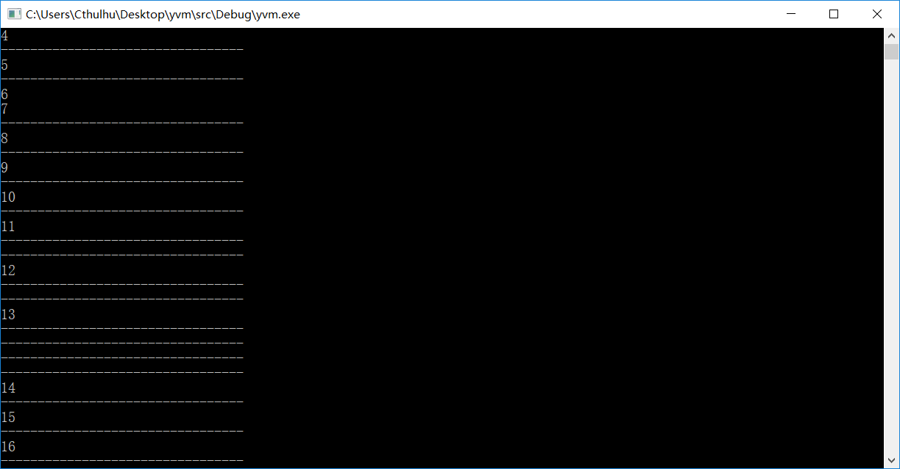
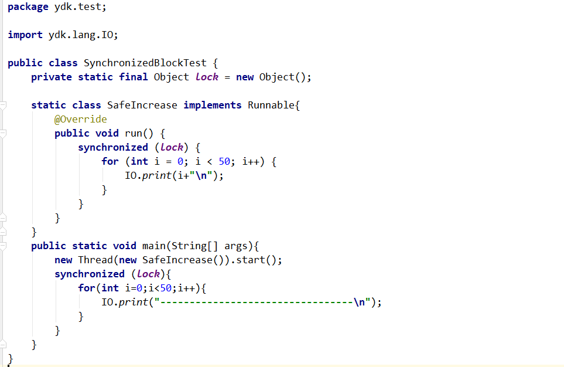

[中文](https://github.com/racaljk/yvm/blob/master/README.md) | [English](https://github.com/racaljk/yvm/blob/master/README.EN.md)

This is a homemade Java virtual machine written in c++, it supports most Java language features and includes a mark-sweep-based concurrent garbage collector. The main components of this VM are conform to [Java Virtual Machine Specification 8](https://docs.oracle.com/javase/specs/jvms/se8/jvms8.pdf). Now it is runnable and sorts of language features will add into this VM in progress. I don't have enough time to write unittests to verify all aspects of yvm, so if you find any bugs, you can open an [Issue](https://github.com/racaljk/yvm/issues/new) or fix up in place and pull request directly. :)

# Available language features
:-0 Advanced language features will support later, you can also PR to help me
+ Java arithmetic, flow control, object-oriented programming(virtual method, inherit,etc.)
+ [Runtime type identification](./javalib_src/ydk/test/InstanceofTest.java)
+ [String concatenation](./javalib_src/ydk/test/StringConcatenation.java)
+ [Exception handling](./javalib_src/ydk/test/ThrowExceptionTest.java)
+ [Async native threads](./javalib_src/ydk/test/CreateAsyncThreadsTest.java)
+ [Synchronized block with object lock](./javalib_src/ydk/test/SynchronizedBlockTest.java)
+ [Garbage Collection(With mark-and-sweep policy)](./javalib_src/ydk/test/GCTest.java)

# Build and run
We provide `visual studio solution` file and a general-purpose `CMakeLists` file.
1. `Configure`
Open `src/Option.h`, define a macro if you are using Windows:
```cpp
#define TARGET_WIN32
```
Or define another one if you are using Linux:
```cpp
#define TARGET_LINUX
```
2. `Compile` If you have a Visual Studio IDE , you can open `src/yvm.sln` to load this project directly. Otherwise, you may need manually make it:
```bash
$ cd yvm
$ cmake .
$ make -j4
```
3. `Run`
```bash
# --runtime to specify runtime libraries of Java program, use ";" to split multi paths
# dotted-decorated program name which you want to run on yvm
./yvm --runtime=C:\Users\Cthulhu\Desktop\yvm\javalib ydk.test.QuickSort
```

# About JDK
Any java virtual machines can not run a Java program without Java libraries. As you may know, some opcodes like `ldc`,`monitorenter/monitorexit`,`athrow` are internally requiring our virtual machine to operate JDK classes('java.lang.Class','java.lang.String','java.lang.Throwable',etc). Hence, I have to rewrite some [JDK classes](javalib_src) for building a runnable VM since original JDK classes are so complicated that it's inconvenient for early developing.
Rewrote JDK classes are as follows:
+ `java.lang.String`
+ `java.lang.StringBuilder`
+ `java.lang.Throwable`
+ `java.lang.Math(::random())`
+ `java.lang.Runnable`
+ `java.lang.Thread`

# Running snapshots
+ helloworld


+ quick sort


+ print stack trace when exception occurred


+ native multithreading


+ multithreading with synchronized(){}


+ Garbage Collection


# Development docs
For more VM development documentation, see its [Wiki](https://github.com/racaljk/yvm/wiki), which contains various contents with regard to VM structures, usages, and design principal, etc.  

# License
Code licensed under the MIT License.