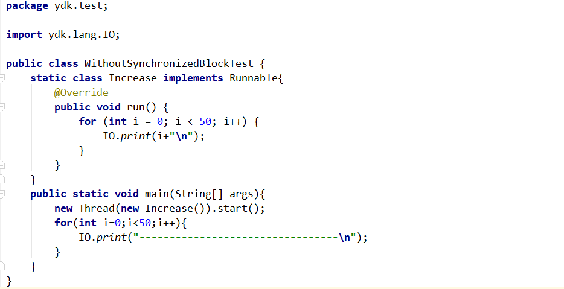

 Yet another java Virtual Machine

[中文](https://github.com/racaljk/yvm/blob/master/README.md) | [English](https://github.com/racaljk/yvm/blob/master/README.EN.md)
| [](https://travis-ci.org/racaljk/yvm) |  | 

YVM是用C++写的一个Java虚拟机，现在支持Java大部分功能，以及一个基于标记清除算法的并发垃圾回收器. 不过还有很多bug等待修复。
感兴趣的朋友pull request/fork/star吧。

# 已支持语言特性
高级特性逐步支持中，可以开Issue提议或者直接PR
+ Java基本算术运算，流程控制语句，面向对象。
+ [RTTI](./javaclass/ydk/test/InstanceofTest.java)
+ [字符串拼接(+,+=符号重载)](./javaclass/ydk/test/StringConcatenation.java)
+ [异常处理(可输出stacktrace)](./javaclass/ydk/test/ThrowExceptionTest.java)
+ [创建异步线程](./javaclass/ydk/test/CreateAsyncThreadsTest.java)
+ [Synchronized(支持对象锁)](./javaclass/ydk/test/SynchronizedBlockTest.java)
+ [垃圾回收(标记清除算法)](./javaclass/ydk/test/GCTest.java)

# 构建和运行
+ 先决条件
  + [Boost](https://www.boost.org/)(>=1.65) 请在`CMakeLists.txt`中手动配置Boost库位置
  + CMake(>=3.5)
  + C++14
  + gcc/msvc/mingw均可
+ 老生常谈
```bash
$ cd yvm
$ cmake .
$ make -j4
$ make test
```
```bash
$ ./yvm --help
Usage:
    --help                List help documentations and usages.
    --runtime arg         Attach java runtime libraries where yvm would lookup 
                        classes at
    --run arg             Program which would be executed soon
You must specify the "runtime" flag to tell yvm where it could find jdk classes, and also program name is required.
$ ./yvm --runtime=C:\Users\Cthulhu\Desktop\yvm\bytecode ydk.test.QuickSort
```

# 运行效果
+ helloworld


+ 快速排序


+ 异常调用栈轨迹


+ 原生多线程


+ Synchronized保护下的多线程


+ 垃圾回收


# 关于JDK
部分JDK类是JVM运行攸关的,但由于JDK比较复杂不便于初期开发,所以这里用重写过的JDK代替,源码参见[javaclass](./javaclass)目录,可以使用`compilejava.bat`进行编译，编译后`*.class`文件位于[bytecode](./bytecode).
目前重写过的JDK类有:
+ `java.lang.String`
+ `java.lang.StringBuilder`
+ `java.lang.Throwable`
+ `java.lang.Math(::random())`
+ `java.lang.Runnable`
+ `java.lang.Thread`

# 开发文档
## 对象和数组表示
虚拟机执行时栈上存放的都是JavaObject,它的结构如下：
```
JavaObject{
    offset:int
    meta:JavaClass
}
```
`offset`唯一代表一个对象，所有在堆上面的操作都需要这个offset。`meta`指向对象的Class表示。
堆中的对象是按照<offset,fields>方式进行存放的：
```
[1]  ->  [field_a, field_b, field_c]
[2]  ->  []
[3]  ->  [field_a,field_b]
[4]  ->  [field_a]
[..] ->  [...]
```
只要我们持有offset，就可以查找/添加/删除对应的field

数组几乎和上面类似,只是多了长度，少了Class指针
```
JavaArray{
    offset:int
    length:int
}
[1]  ->   <3, [field_a, field_b, field_c]>
[2]  ->   <0, []>
[3]  ->   <2, [field_a,field_b]>
[4]  ->   <1, [field_a]>
[..] ->   <..,[...]>
class ArrayPool {
```

[Wiki](https://github.com/racaljk/yvm/wiki)和源码中有很多详细的开发文档，如果想探索关于`YVM`的更多内容，请移步浏览:-)


# License
Code licensed under the MIT License.
